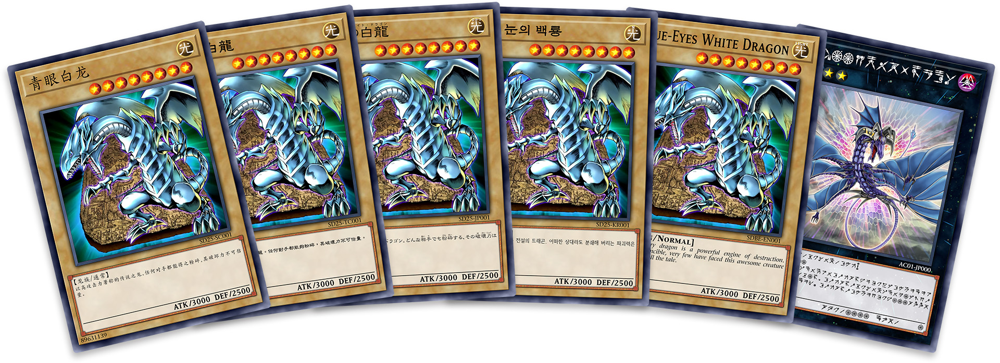

<h1 align="center">🎉 游戏王卡片 - Yugioh Card 🎉</h1>

<div align="center">
  <p>简体中文 | <a href="./README.en.md">English</a></p>
</div>

<p align="center">
  <a href="https://www.npmjs.org/package/yugioh-card">
    
  </a>
  <a href="https://www.npmjs.org/package/yugioh-card">
    
  </a>
  <a href="LICENSE">
    
  </a>
</p>

<p align="center">一个使用 Canvas 渲染游戏王卡片的工具</p>

<p align="center">
  
</p>

目前有 5 种卡片：🚀🚀🚀🚀🚀

- 1️⃣ 游戏王
- 2️⃣ 超速决斗
- 3️⃣ 游戏王卡背
- 4️⃣ 场地中心卡
- 5️⃣ 游戏王 2 期

## 🫡 特别感谢

- [LeaferJS](https://www.leaferjs.com/) 提供的强大图形渲染功能
- [白羽幸鳥](https://tieba.baidu.com/home/main?id=tb.1.d6c63ffd.3YV5T6Q9Z7uIeVVhPlo8hg%3Ft%3D1654573649) 提供的高清卡模

## 🚩 在线演示

[在线演示](https://kooriookami.github.io/yugioh-card/)

## ⚡ 快速开始

`pnpm add yugioh-card`

### 仓库开发

```bash
pnpm install
pnpm dev
pnpm build
pnpm build:lib
```

### 浏览器

```js
// 可选 YugiohCard, RushDuelCard, YugiohBackCard, FieldCenterCard, YugiohSeries2Card
import { YugiohCard } from 'yugioh-card';

const card = new YugiohCard({
  view: 'xxx', // div 容器
  data: {
    ..., // 参数见下方 Data 属性
  },
  resourcePath: 'xxx', // 静态资源路径，把 src/assets/yugioh-card 文件夹复制到你的项目中或者服务器上
});

// 导出图片，更多导出参数请参考 https://www.leaferjs.com/ui/guide/basic/export.html
card.leafer.export('xxx.png', {
  screenshot: true,
  pixelRatio: devicePixelRatio,
});
```

### Node.js

`pnpm add skia-canvas`

```js
import http from 'http';
import skia from 'skia-canvas';
import { YugiohCard } from 'yugioh-card';

http.createServer((req, res) => {
  const card = new YugiohCard({
    data: {
      ..., // 参数见下方 Data 属性
    },
    resourcePath: 'xxx', // 静态资源路径，把 src/assets/yugioh-card 文件夹复制到你的项目中或者服务器上
    skia: skia,
  });
  card.leafer.export('png', {
    screenshot: true,
  }).then(result => {
    res.writeHead(200, { 'Content-Type': 'text/html' });
    res.write(``);
    res.end();
  });
}).listen(3000, () => {
    console.log('server is running at http://localhost:3000');
});
```

## 🔎 示例代码

[示例代码](src/components/YugiohCard.vue)

## 📖 Data 属性

### 游戏王

|         属性名         |    说明     |   类型    |                                                         可选值                                                         |                   备注                    |        默认值        |
|:-------------------:|:---------:|:-------:|:-------------------------------------------------------------------------------------------------------------------:|:---------------------------------------:|:-----------------:|
|      language       |    语言     |  enum   |                                     'sc' / 'tc' / 'jp' / 'kr' / 'en' / 'astral'                                     |    简体中文 / 繁体中文 / 日文 / 韩文 / 英文 / 星光界文    |       'sc'        |
|        font         |    字体     |  enum   |                                             '' / 'custom1' / 'custom2'                                              |            默认 / 自定义一 / 自定义二             |        ''         |
|        name         |    卡名     | string  |                                                          —                                                          |                    —                    |        ''         |
|        color        |   卡名颜色    | string  |                                                          —                                                          |                    —                    |        ''         |
|        align        |   卡名对齐    |  enum   |                                             'left' / 'center' / 'right'                                             |             左对齐 / 居中 / 右对齐              |      'left'       |
|      gradient       |  卡名是否渐变色  | boolean |                                                          —                                                          |                    —                    |       false       |
|   gradientColor1    |   渐变色 1   | string  |                                                          —                                                          |                    —                    |     '#999999'     |
|   gradientColor2    |   渐变色 2   | string  |                                                          —                                                          |                    —                    |     '#ffffff'     |
|        type         |    类型     |  enum   |                                      'monster' / 'spell' / 'trap' / 'pendulum'                                      |            怪兽 / 魔法 / 陷阱 / 灵摆            |     'monster'     |
|      attribute      |    属性     |  enum   |                       'dark' / 'light' / 'earth' / 'water' / 'fire' / 'wind' / 'divine' / ''                        |      暗 / 光 / 地 / 水 / 炎 / 风 / 神 / 无      |      'dark'       |
|        icon         |   魔陷图标    |  enum   |                       'equip' / 'field' / 'quick-play' / 'ritual' / 'continuous' / 'counter'                        |       装备 / 场地 / 速攻 / 仪式 / 永续 / 反击       |        ''         |
|        image        |   中间卡图    | string  |                                                          —                                                          |                    —                    |        ''         |
|      cardType       |   卡片类型    |  enum   |                  'normal' / 'effect' / 'ritual' / 'fusion' / 'synchro' / 'xyz' / 'link' / 'token'                   | 通常 / 效果 / 仪式 / 融合 / 同调 / 超量 / 连接 / 衍生物  |     'normal'      |
|    pendulumType     |   灵摆类型    |  enum   | 'normal-pendulum' / 'effect-pendulum' / 'ritual-pendulum' / 'fusion-pendulum' / 'synchro-pendulum' / 'xyz-pendulum' | 通常灵摆 / 效果灵摆 / 仪式灵摆 / 融合灵摆 / 同调灵摆 / 超量灵摆 | 'normal-pendulum' |
|        level        |    星级     | number  |                                                          —                                                          |                    —                    |         0         |
|        rank         |    阶级     | number  |                                                          —                                                          |                    —                    |         0         |
|    pendulumScale    |   灵摆刻度    | number  |                                                          —                                                          |                    —                    |         0         |
| pendulumDescription |   灵摆效果    | string  |                                                          —                                                          |                    —                    |        ''         |
|     monsterType     |   怪兽类型    | string  |                                                          —                                                          |                    —                    |        ''         |
|       atkBar        |    攻守条    | boolean |                                                          —                                                          |                    —                    |       true        |
|         atk         |    攻击力    | number  |                                                          —                                                          |                ?：-1，∞：-2                |         0         |
|         def         |    防御力    | number  |                                                          —                                                          |                ?：-1，∞：-2                |         0         |
|      arrowList      |   连接箭头    |  array  |                                              [1, 2, 3, 4, 5, 6, 7, 8]                                               |      [上, 右上, 右, 右下, 下, 左下, 左, 左上]       |        []         |
|     description     |   效果描述    | string  |                                                          —                                                          |                    —                    |        ''         |
|  firstLineCompress  |  是否首行压缩   | boolean |                                                          —                                                          |                    —                    |       false       |
|  descriptionAlign   | 是否效果描述居中  | boolean |                                                          —                                                          |                    —                    |       false       |
|   descriptionZoom   |  效果描述缩放   | number  |                                                          —                                                          |                    —                    |         1         |
|  descriptionWeight  |  效果描述字重   | number  |                                                          —                                                          |                    —                    |         0         |
|       package       |    卡包     | string  |                                                          —                                                          |                    —                    |        ''         |
|      password       |   卡片密码    | string  |                                                          —                                                          |                    —                    |        ''         |
|      copyright      |    版权     |  enum   |                                                 'sc' / 'jp' / 'en'                                                  |             简体中文 / 日文 / 英文              |        ''         |
|        laser        |    角标     |  enum   |                                      'laser1' / 'laser2' / 'laser3' / 'laser4'                                      |          样式一 / 样式二 / 样式三 / 样式四          |        ''         |
|        rare         |    罕贵     |  enum   |                                 'dt' / 'ur' / 'gr' / 'hr' / 'ser' / 'gser' / 'pser'                                 |  DT / UR / GR / HR / SER / GSER / PSER  |        ''         |
|      twentieth      | 是否是 20 周年 | boolean |                                                          —                                                          |                    —                    |       false       |
|       radius        |   是否是圆角   | boolean |                                                          —                                                          |                    —                    |       true        |
|        scale        |   卡片缩放    | number  |                                                          —                                                          |                    —                    |         1         |

### 超速决斗

|        属性名        |    说明    |   类型    |                                  可选值                                   |              备注               |    默认值    |
|:-----------------:|:--------:|:-------:|:----------------------------------------------------------------------:|:-----------------------------:|:---------:|
|     language      |    语言    |  enum   |                              'sc' / 'jp'                               |           简体中文 / 日文           |   'sc'    |
|       name        |    卡名    | string  |                                   —                                    |               —               |    ''     |
|       color       |   卡名颜色   | string  |                                   —                                    |               —               |    ''     |
|       type        |    类型    |  enum   |                      'monster' / 'spell' / 'trap'                      |         怪兽 / 魔法 / 陷阱          | 'monster' |
|     attribute     |    属性    |  enum   | 'dark' / 'light' / 'earth' / 'water' / 'fire' / 'wind' / 'divine' / '' | 暗 / 光 / 地 / 水 / 炎 / 风 / 神 / 无 |  'dark'   |
|       icon        |   魔陷图标   |  enum   | 'equip' / 'field' / 'quick-play' / 'ritual' / 'continuous' / 'counter' |  装备 / 场地 / 速攻 / 仪式 / 永续 / 反击  |    ''     |
|       image       |   中间卡图   | string  |                                   —                                    |               —               |    ''     |
|     cardType      |   卡片类型   |  enum   |               'normal' / 'effect' / 'ritual' / 'fusion'                |       通常 / 效果 / 仪式 / 融合       | 'normal'  |
|       level       |    星级    | number  |                                   —                                    |               —               |     0     |
|    monsterType    |   怪兽类型   | string  |                                   —                                    |               —               |    ''     |
|    maximumAtk     |  极限攻击力   | number  |                                   —                                    |               —               |     0     |
|        atk        |   攻击力    | number  |                                   —                                    |             ?：-1              |     0     |
|        def        |   防御力    | number  |                                   —                                    |             ?：-1              |     0     |
|    description    |   效果描述   | string  |                                   —                                    |               —               |    ''     |
| firstLineCompress |  是否首行压缩  | boolean |                                   —                                    |               —               |   false   |
| descriptionAlign  | 是否效果描述居中 | boolean |                                   —                                    |               —               |   false   |
|  descriptionZoom  |  效果描述缩放  | number  |                                   —                                    |               —               |     1     |
| descriptionWeight |  效果描述字重  | number  |                                   —                                    |               —               |     0     |
|      package      |    卡包    | string  |                                   —                                    |               —               |    ''     |
|     password      |   卡片密码   | string  |                                   —                                    |               —               |    ''     |
|      legend       |  是否是传说   | boolean |                                   —                                    |               —               |   false   |
|       laser       |    角标    |  enum   |               'laser1' / 'laser2' / 'laser3' / 'laser4'                |     样式一 / 样式二 / 样式三 / 样式四     |    ''     |
|       rare        |    罕贵    |  enum   |                          'sr' / 'rr' / 'pser'                          |        SR / RR / PSER         |    ''     |
|      radius       |  是否是圆角   | boolean |                                   —                                    |               —               |   true    |
|       scale       |   卡片缩放   | number  |                                   —                                    |               —               |     1     |

### 游戏王卡背

|   属性名    |   说明    |   类型    |                           可选值                           |          备注          |   默认值    |
|:--------:|:-------:|:-------:|:-------------------------------------------------------:|:--------------------:|:--------:|
|   type   |  卡背类型   |  enum   | 'normal' / 'tormentor' / 'sky-dragon' / 'winged-dragon' | 通常 / 巨神兵 / 天空龙 / 翼神龙 | 'normal' |
|   logo   |   标志    |  enum   |                  'ocg' / 'tcg' / 'rd'                   |    OCG / TCG / RD    |  'ocg'   |
|  konami  | 是否有 K 标 | boolean |                            —                            |          —           |   true   |
| register | 是否有 R 标 | boolean |                            —                            |          —           |   true   |
|  radius  |  是否是圆角  | boolean |                            —                            |          —           |   true   |
|  scale   |  卡片缩放   | number  |                            —                            |          —           |    1     |

### 场地中心卡

|   属性名    |  说明   |   类型    | 可选值 | 备注 |  默认值  |
|:--------:|:-----:|:-------:|:---:|:--:|:-----:|
|  image   | 场地图片  | string  |  —  | —  |  ''   |
| cardBack | 是否是卡背 | boolean |  —  | —  | false |
|  radius  | 是否是圆角 | boolean |  —  | —  | true  |
|  scale   | 卡片缩放  | number  |  —  | —  |   1   |

### 游戏王 2 期

|        属性名        |    说明    |   类型    |                                           可选值                                            |                 备注                  |    默认值    |
|:-----------------:|:--------:|:-------:|:----------------------------------------------------------------------------------------:|:-----------------------------------:|:---------:|
|     language      |    语言    |  enum   |                                           'jp'                                           |                 日文                  |   'jp'    |
|       font        |    字体    |  enum   |                                '' / 'custom1' / 'custom2'                                |          默认 / 自定义一 / 自定义二           |    ''     |
|       name        |    卡名    | string  |                                            —                                             |                  —                  |    ''     |
|       color       |   卡名颜色   | string  |                                            —                                             |                  —                  |    ''     |
|       align       |   卡名对齐   |  enum   |                               'left' / 'center' / 'right'                                |           左对齐 / 居中 / 右对齐            |  'left'   |
|     gradient      | 卡名是否渐变色  | boolean |                                            —                                             |                  —                  |   false   |
|  gradientColor1   |  渐变色 1   | string  |                                            —                                             |                  —                  | '#999999' |
|  gradientColor2   |  渐变色 2   | string  |                                            —                                             |                  —                  | '#ffffff' |
|       type        |    类型    |  enum   |                               'monster' / 'spell' / 'trap'                               |            怪兽 / 魔法 / 陷阱             | 'monster' |
|     attribute     |    属性    |  enum   |          'dark' / 'light' / 'earth' / 'water' / 'fire' / 'wind' / 'divine' / ''          |    暗 / 光 / 地 / 水 / 炎 / 风 / 神 / 无    |  'dark'   |
|       icon        |   魔陷图标   |  enum   |          'equip' / 'field' / 'quick-play' / 'ritual' / 'continuous' / 'counter'          |     装备 / 场地 / 速攻 / 仪式 / 永续 / 反击     |    ''     |
|       image       |   中间卡图   | string  |                                            —                                             |                  —                  |    ''     |
|     cardType      |   卡片类型   |  enum   | 'normal' / 'effect' / 'ritual' / 'fusion' / 'tormentor' / 'sky-dragon' / 'winged-dragon' | 通常 / 效果 / 仪式 / 融合 / 巨神兵 / 天空龙 / 翼神龙 | 'normal'  |
|       level       |    星级    | number  |                                            —                                             |                  —                  |     0     |
|    monsterType    |   怪兽类型   | string  |                                            —                                             |                  —                  |    ''     |
|        atk        |   攻击力    | number  |                                            —                                             |           ????：-1，X000：-2           |     0     |
|        def        |   防御力    | number  |                                            —                                             |           ????：-1，X000：-2           |     0     |
|    description    |   效果描述   | string  |                                            —                                             |                  —                  |    ''     |
| firstLineCompress |  是否首行压缩  | boolean |                                            —                                             |                  —                  |   false   |
| descriptionAlign  | 是否效果描述居中 | boolean |                                            —                                             |                  —                  |   false   |
|  descriptionZoom  |  效果描述缩放  | number  |                                            —                                             |                  —                  |     1     |
| descriptionWeight |  效果描述字重  | number  |                                            —                                             |                  —                  |     0     |
|      package      |    卡包    | string  |                                            —                                             |                  —                  |    ''     |
|     password      |   卡片密码   | string  |                                            —                                             |                  —                  |    ''     |
|     copyright     |    版权    |  enum   |                                           'jp'                                           |                 日文                  |    ''     |
|       laser       |    角标    |  enum   |                        'laser1' / 'laser2' / 'laser3' / 'laser4'                         |        样式一 / 样式二 / 样式三 / 样式四        |    ''     |
|      radius       |  是否是圆角   | boolean |                                            —                                             |                  —                  |   true    |
|       scale       |   卡片缩放   | number  |                                            —                                             |                  —                  |     1     |
